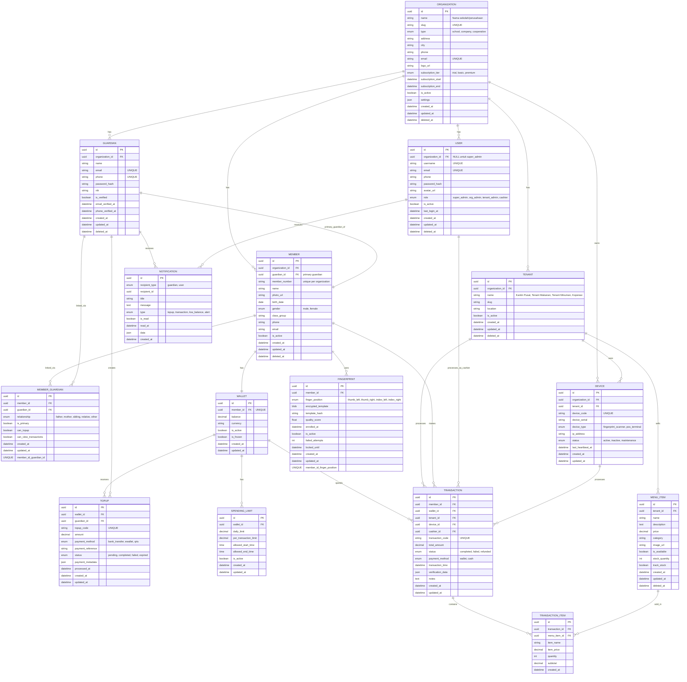

# ERD Final - Multi-Tenant Cashless Payment Platform



---

## Struktur Hierarki

```
ORGANIZATION (Sekolah/Perusahaan)
├── TENANT 1 (Kantin Pusat)
│   ├── MENU_ITEM (Nasi Goreng, Es Teh, dll)
│   └── DEVICE (Fingerprint Scanner)
├── TENANT 2 (Tenant Makanan Berat)
│   ├── MENU_ITEM (Nasi Uduk, Soto, dll)
│   └── DEVICE (POS Terminal)
├── TENANT 3 (Tenant Minuman & Snack)
│   └── MENU_ITEM (Aqua, Chitato, dll)
└── MEMBER (Siswa/Karyawan)
    ├── WALLET
    └── FINGERPRINT
```

---

## Total: 14 Entities

**Core (6)**:
- ORGANIZATION
- USER
- TENANT
- GUARDIAN
- MEMBER
- MEMBER_GUARDIAN

**Financial (3)**:
- WALLET
- TOPUP
- SPENDING_LIMIT

**Transaction (3)**:
- MENU_ITEM
- TRANSACTION
- TRANSACTION_ITEM

**Device (2)**:
- DEVICE
- FINGERPRINT

**Communication (1)**:
- NOTIFICATION
