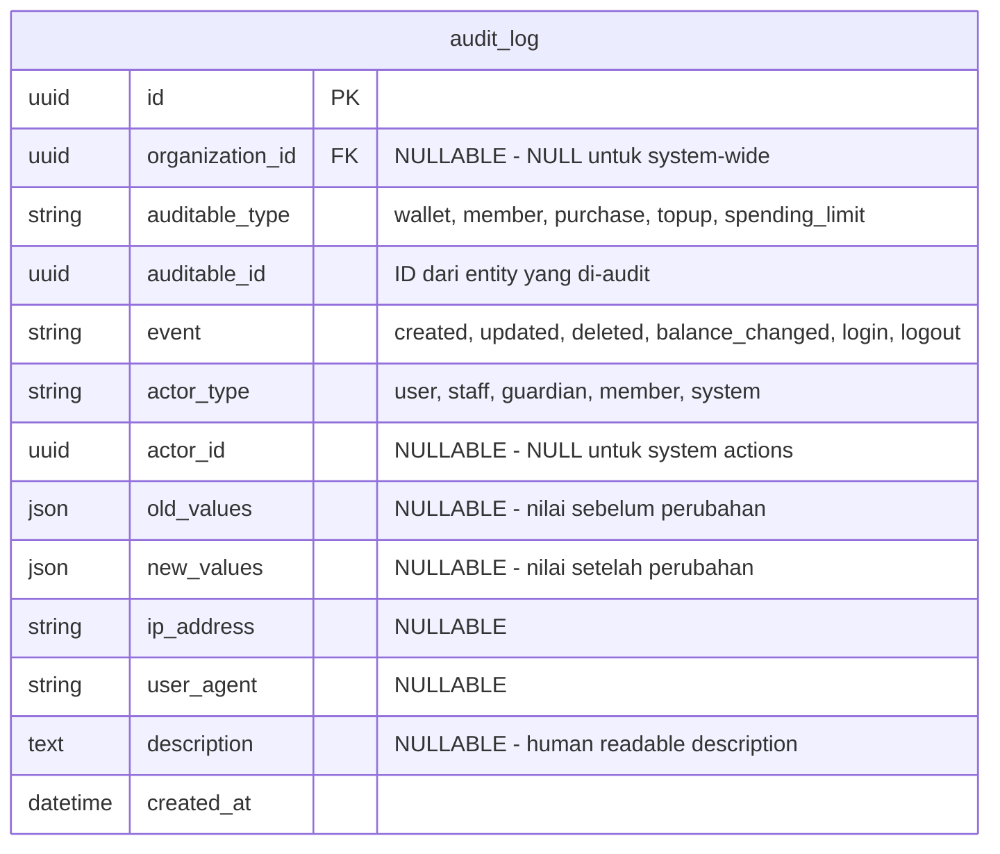
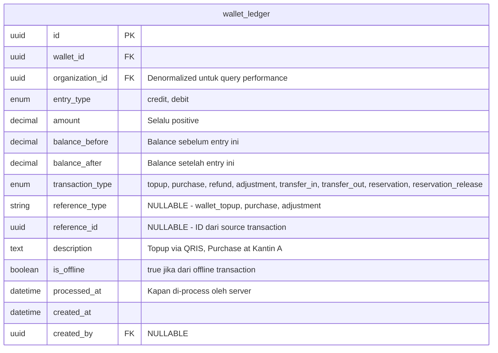
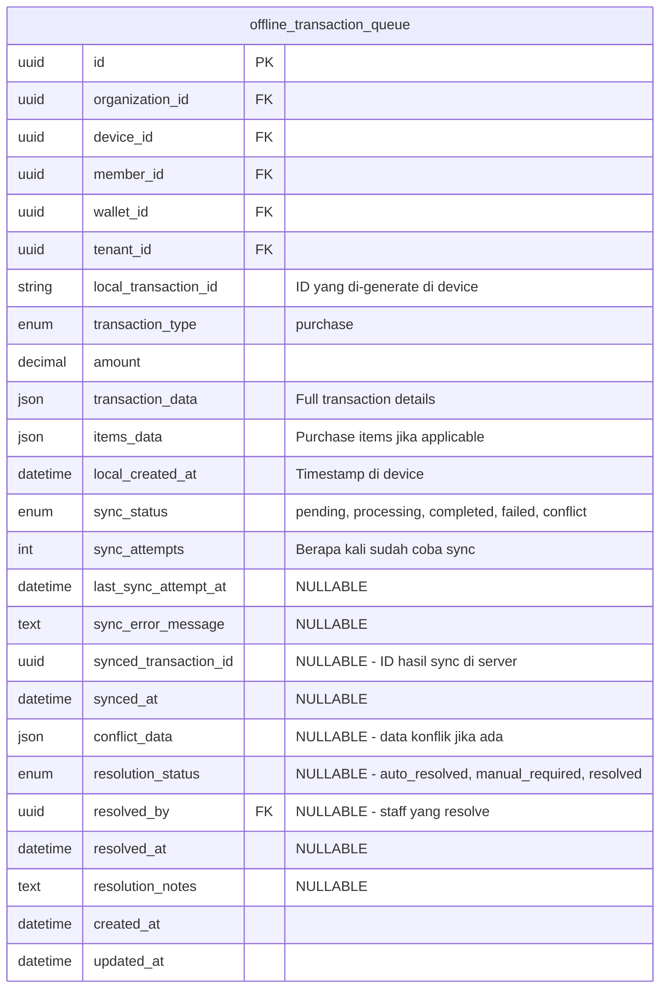
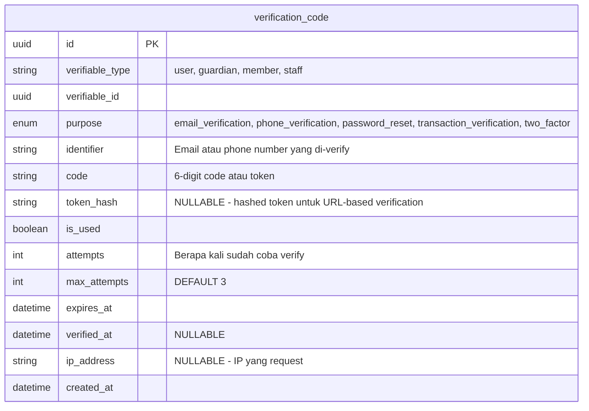
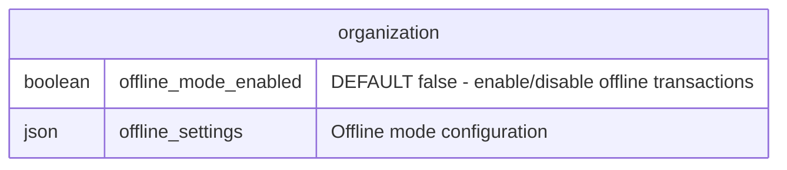
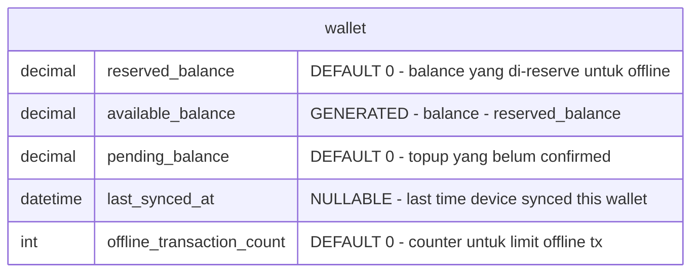
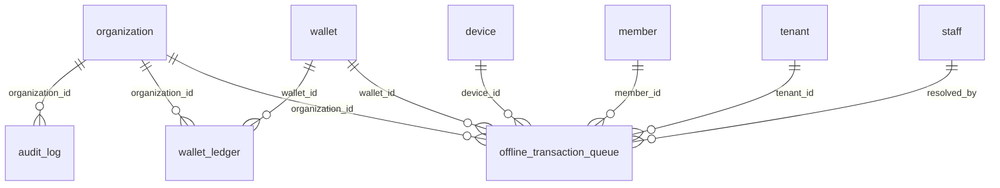

# ERD V4 - Rekomendasi Perubahan

**Tanggal:** 2025-11-22
**Status:** Draft untuk Review
**Tujuan:** Menambahkan table dan modifikasi untuk MVP yang scalable dengan fokus pada:
- Audit trail lengkap
- Pencegahan overdraft
- Offline transaction support
- Security verification

---

## Ringkasan Perubahan

### Table Baru (4 tables)
1. `audit_log` - Track semua perubahan penting
2. `wallet_ledger` - Double-entry untuk balance tracking
3. `offline_transaction_queue` - Sync mechanism untuk offline mode
4. `verification_code` - OTP untuk registrasi & sensitive actions

### Modifikasi Table Existing (2 tables)
1. `organization` - Tambah offline_mode_settings
2. `wallet` - Tambah reserved_balance untuk offline support

---

## 1. Table Baru: audit_log

**Fungsi:** Mencatat semua perubahan penting untuk compliance dan security audit.



**Index yang diperlukan:**
```sql
CREATE INDEX idx_audit_log_org_created ON audit_log(organization_id, created_at DESC);
CREATE INDEX idx_audit_log_auditable ON audit_log(auditable_type, auditable_id);
CREATE INDEX idx_audit_log_actor ON audit_log(actor_type, actor_id);
CREATE INDEX idx_audit_log_event ON audit_log(event, created_at DESC);
```

**Contoh penggunaan:**
```json
{
  "auditable_type": "wallet",
  "auditable_id": "uuid-wallet",
  "event": "balance_changed",
  "actor_type": "guardian",
  "actor_id": "uuid-guardian",
  "old_values": {"balance": 100000},
  "new_values": {"balance": 150000},
  "description": "Top-up Rp 50.000 via QRIS"
}
```

---

## 2. Table Baru: wallet_ledger

**Fungsi:** Double-entry ledger untuk tracking setiap pergerakan balance. Ini adalah **source of truth** untuk balance.



**Constraints penting:**
```sql
-- Balance tidak boleh negatif
ALTER TABLE wallet_ledger
ADD CONSTRAINT chk_balance_non_negative
CHECK (balance_after >= 0);

-- Amount harus positive
ALTER TABLE wallet_ledger
ADD CONSTRAINT chk_amount_positive
CHECK (amount > 0);
```

**Index yang diperlukan:**
```sql
CREATE INDEX idx_ledger_wallet_created ON wallet_ledger(wallet_id, created_at DESC);
CREATE INDEX idx_ledger_org_created ON wallet_ledger(organization_id, created_at DESC);
CREATE INDEX idx_ledger_reference ON wallet_ledger(reference_type, reference_id);
CREATE INDEX idx_ledger_type_created ON wallet_ledger(transaction_type, created_at DESC);
```

**Cara kerja:**

1. **Top-up Rp 50.000:**
```json
{
  "entry_type": "credit",
  "amount": 50000,
  "balance_before": 100000,
  "balance_after": 150000,
  "transaction_type": "topup",
  "reference_type": "wallet_topup",
  "reference_id": "uuid-topup"
}
```

2. **Purchase Rp 25.000:**
```json
{
  "entry_type": "debit",
  "amount": 25000,
  "balance_before": 150000,
  "balance_after": 125000,
  "transaction_type": "purchase",
  "reference_type": "purchase",
  "reference_id": "uuid-purchase"
}
```

3. **Balance Reservation untuk Offline:**
```json
{
  "entry_type": "debit",
  "amount": 50000,
  "balance_before": 125000,
  "balance_after": 75000,
  "transaction_type": "reservation",
  "description": "Reserved for offline mode"
}
```

**Reconciliation Query:**
```sql
-- Verify balance consistency
SELECT
  w.id,
  w.balance as stored_balance,
  (SELECT balance_after FROM wallet_ledger
   WHERE wallet_id = w.id
   ORDER BY created_at DESC LIMIT 1) as ledger_balance,
  CASE WHEN w.balance = ledger_balance THEN 'OK' ELSE 'MISMATCH' END as status
FROM wallet w;
```

---

## 3. Table Baru: offline_transaction_queue

**Fungsi:** Menyimpan transaksi yang dibuat saat device offline, untuk di-sync saat online.



**Index yang diperlukan:**
```sql
CREATE INDEX idx_offline_queue_device_status ON offline_transaction_queue(device_id, sync_status);
CREATE INDEX idx_offline_queue_org_status ON offline_transaction_queue(organization_id, sync_status);
CREATE INDEX idx_offline_queue_member ON offline_transaction_queue(member_id, local_created_at DESC);
CREATE UNIQUE INDEX idx_offline_queue_local_id ON offline_transaction_queue(device_id, local_transaction_id);
```

**Sync Flow:**

```
1. Device creates transaction offline
   └─ sync_status = 'pending'

2. Device comes online, sends to server
   └─ sync_status = 'processing'

3. Server validates:
   a. Balance sufficient?
   b. Member active?
   c. Within time limits?
   d. No duplicate?

4. If valid:
   └─ Create real purchase
   └─ Create ledger entry
   └─ sync_status = 'completed'
   └─ synced_transaction_id = purchase.id

5. If invalid (e.g., insufficient balance):
   └─ sync_status = 'failed'
   └─ sync_error_message = 'Insufficient balance'
   └─ Notify cashier/admin

6. If conflict (e.g., duplicate):
   └─ sync_status = 'conflict'
   └─ resolution_status = 'manual_required'
   └─ Notify admin
```

---

## 4. Table Baru: verification_code

**Fungsi:** Menyimpan OTP dan verification codes untuk berbagai keperluan security.



**Constraints:**
```sql
-- Auto-delete expired codes (bisa via cron job)
-- Atau gunakan TTL jika pakai Redis untuk store codes
```

**Index yang diperlukan:**
```sql
CREATE INDEX idx_verification_identifier ON verification_code(identifier, purpose, is_used);
CREATE INDEX idx_verification_expires ON verification_code(expires_at) WHERE is_used = false;
CREATE INDEX idx_verification_verifiable ON verification_code(verifiable_type, verifiable_id);
```

**Contoh penggunaan:**

1. **Email Verification saat registrasi:**
```json
{
  "verifiable_type": "user",
  "verifiable_id": "uuid-user",
  "purpose": "email_verification",
  "identifier": "parent@email.com",
  "code": "123456",
  "max_attempts": 3,
  "expires_at": "2025-11-22T15:30:00Z"
}
```

2. **Phone OTP untuk guardian:**
```json
{
  "verifiable_type": "guardian",
  "verifiable_id": "uuid-guardian",
  "purpose": "phone_verification",
  "identifier": "081234567890",
  "code": "789012",
  "max_attempts": 3,
  "expires_at": "2025-11-22T14:05:00Z"
}
```

---

## 5. Modifikasi Table: organization

**Perubahan:** Tambah field untuk offline mode settings.



**Struktur offline_settings:**
```json
{
  "max_offline_duration_hours": 4,
  "default_reserved_percentage": 25,
  "max_reserved_amount": 100000,
  "min_reserved_amount": 20000,
  "max_single_offline_transaction": 50000,
  "max_offline_transactions_count": 10,
  "require_sync_before_shift_end": true,
  "auto_disable_after_failed_syncs": 3
}
```

**SQL Migration:**
```sql
ALTER TABLE organization
ADD COLUMN offline_mode_enabled BOOLEAN DEFAULT false;

ALTER TABLE organization
ADD COLUMN offline_settings JSONB DEFAULT '{
  "max_offline_duration_hours": 4,
  "default_reserved_percentage": 25,
  "max_reserved_amount": 100000,
  "min_reserved_amount": 20000,
  "max_single_offline_transaction": 50000,
  "max_offline_transactions_count": 10,
  "require_sync_before_shift_end": true,
  "auto_disable_after_failed_syncs": 3
}'::jsonb;
```

---

## 6. Modifikasi Table: wallet

**Perubahan:** Tambah fields untuk balance reservation dan overdraft prevention.



**Constraints:**
```sql
-- Available balance adalah computed field
ALTER TABLE wallet
ADD COLUMN available_balance DECIMAL GENERATED ALWAYS AS (balance - reserved_balance) STORED;

-- Reserved balance tidak boleh melebihi balance
ALTER TABLE wallet
ADD CONSTRAINT chk_reserved_not_exceed
CHECK (reserved_balance <= balance);

-- Reserved balance tidak boleh negatif
ALTER TABLE wallet
ADD CONSTRAINT chk_reserved_non_negative
CHECK (reserved_balance >= 0);
```

**SQL Migration:**
```sql
ALTER TABLE wallet
ADD COLUMN reserved_balance DECIMAL(15,2) DEFAULT 0;

ALTER TABLE wallet
ADD COLUMN pending_balance DECIMAL(15,2) DEFAULT 0;

ALTER TABLE wallet
ADD COLUMN last_synced_at TIMESTAMP;

ALTER TABLE wallet
ADD COLUMN offline_transaction_count INTEGER DEFAULT 0;

-- Computed column (PostgreSQL)
ALTER TABLE wallet
ADD COLUMN available_balance DECIMAL(15,2)
GENERATED ALWAYS AS (balance - reserved_balance) STORED;
```

**Cara kerja Balance Reservation:**

```
ONLINE MODE:
┌─────────────────────────────┐
│ balance:           200.000  │
│ reserved_balance:        0  │
│ available_balance: 200.000  │ ← semua bisa dipakai
└─────────────────────────────┘

SEBELUM OFFLINE (sync):
┌─────────────────────────────┐
│ balance:           200.000  │
│ reserved_balance:   50.000  │ ← dicadangkan untuk offline
│ available_balance: 150.000  │
└─────────────────────────────┘

SAAT OFFLINE:
- Device hanya boleh pakai dari reserved (50.000)
- Server tetap bisa proses online tx dari available (150.000)

SETELAH SYNC:
- Offline transactions di-process
- Reserved balance di-release
- Balance di-update accordingly
```

---

## 7. Relationships Baru

Tambahkan ke bagian relationships di ERD:



---

## 8. Database Constraints untuk Overdraft Prevention

**Critical constraints yang HARUS ada:**

```sql
-- 1. Wallet balance tidak boleh negatif
ALTER TABLE wallet
ADD CONSTRAINT chk_wallet_balance_non_negative
CHECK (balance >= 0);

-- 2. Ledger balance_after tidak boleh negatif
ALTER TABLE wallet_ledger
ADD CONSTRAINT chk_ledger_balance_non_negative
CHECK (balance_after >= 0);

-- 3. Function untuk atomic balance update
CREATE OR REPLACE FUNCTION deduct_wallet_balance(
  p_wallet_id UUID,
  p_amount DECIMAL,
  p_transaction_type VARCHAR,
  p_reference_type VARCHAR,
  p_reference_id UUID,
  p_description TEXT,
  p_is_offline BOOLEAN DEFAULT false
) RETURNS UUID AS $$
DECLARE
  v_current_balance DECIMAL;
  v_new_balance DECIMAL;
  v_ledger_id UUID;
BEGIN
  -- Lock wallet row
  SELECT balance INTO v_current_balance
  FROM wallet
  WHERE id = p_wallet_id
  FOR UPDATE;

  -- Check sufficient balance
  v_new_balance := v_current_balance - p_amount;

  IF v_new_balance < 0 THEN
    RAISE EXCEPTION 'Insufficient balance. Current: %, Required: %',
      v_current_balance, p_amount;
  END IF;

  -- Update wallet balance
  UPDATE wallet
  SET balance = v_new_balance, updated_at = NOW()
  WHERE id = p_wallet_id;

  -- Create ledger entry
  INSERT INTO wallet_ledger (
    id, wallet_id, organization_id, entry_type, amount,
    balance_before, balance_after, transaction_type,
    reference_type, reference_id, description, is_offline,
    processed_at, created_at
  )
  SELECT
    gen_random_uuid(), p_wallet_id, m.organization_id, 'debit', p_amount,
    v_current_balance, v_new_balance, p_transaction_type,
    p_reference_type, p_reference_id, p_description, p_is_offline,
    NOW(), NOW()
  FROM wallet w
  JOIN member m ON w.member_id = m.id
  WHERE w.id = p_wallet_id
  RETURNING id INTO v_ledger_id;

  RETURN v_ledger_id;
END;
$$ LANGUAGE plpgsql;
```

---

## 9. Implementation Notes

### Prioritas Implementasi untuk MVP

| Priority | Table/Feature | Alasan |
|----------|--------------|--------|
| P0 | wallet_ledger | Core untuk prevent overdraft |
| P0 | Wallet constraints | Database-level protection |
| P1 | audit_log | Compliance & debugging |
| P1 | verification_code | Security untuk registrasi |
| P2 | offline_transaction_queue | Hanya jika org enable offline |
| P2 | Organization offline_settings | Hanya untuk org yang butuh |

### Caching Strategy

```
Redis Cache untuk:
- wallet.balance (TTL: 30 detik)
- member.fingerprint_template (TTL: 5 menit)
- organization.settings (TTL: 1 jam)

Invalidate cache saat:
- Balance berubah (topup, purchase, refund)
- Settings berubah
```

### Monitoring Queries

```sql
-- 1. Check for balance mismatches
SELECT w.id, w.balance,
  (SELECT balance_after FROM wallet_ledger
   WHERE wallet_id = w.id ORDER BY created_at DESC LIMIT 1) as ledger_balance
FROM wallet w
WHERE w.balance != (
  SELECT balance_after FROM wallet_ledger
  WHERE wallet_id = w.id ORDER BY created_at DESC LIMIT 1
);

-- 2. Pending offline transactions
SELECT organization_id, COUNT(*) as pending_count
FROM offline_transaction_queue
WHERE sync_status = 'pending'
GROUP BY organization_id;

-- 3. Failed syncs that need attention
SELECT * FROM offline_transaction_queue
WHERE sync_status = 'failed'
  AND resolution_status IS NULL
ORDER BY created_at;
```

---

## 10. ERD Snippet (Mermaid Format)

Berikut snippet yang bisa ditambahkan ke `erd-v4-user-profile.mmd`:

```mermaid
    audit_log {
        uuid id PK
        uuid organization_id FK "NULLABLE"
        string auditable_type "wallet, member, purchase, etc"
        uuid auditable_id
        string event "created, updated, deleted, balance_changed"
        string actor_type "user, staff, guardian, member, system"
        uuid actor_id "NULLABLE"
        json old_values "NULLABLE"
        json new_values "NULLABLE"
        string ip_address "NULLABLE"
        string user_agent "NULLABLE"
        text description "NULLABLE"
        datetime created_at
    }

    wallet_ledger {
        uuid id PK
        uuid wallet_id FK
        uuid organization_id FK
        enum entry_type "credit, debit"
        decimal amount
        decimal balance_before
        decimal balance_after
        enum transaction_type "topup, purchase, refund, adjustment, reservation"
        string reference_type "NULLABLE"
        uuid reference_id "NULLABLE"
        text description
        boolean is_offline
        datetime processed_at
        datetime created_at
        uuid created_by FK "NULLABLE"
    }

    offline_transaction_queue {
        uuid id PK
        uuid organization_id FK
        uuid device_id FK
        uuid member_id FK
        uuid wallet_id FK
        uuid tenant_id FK
        string local_transaction_id
        enum transaction_type "purchase"
        decimal amount
        json transaction_data
        json items_data
        datetime local_created_at
        enum sync_status "pending, processing, completed, failed, conflict"
        int sync_attempts
        datetime last_sync_attempt_at "NULLABLE"
        text sync_error_message "NULLABLE"
        uuid synced_transaction_id "NULLABLE"
        datetime synced_at "NULLABLE"
        json conflict_data "NULLABLE"
        enum resolution_status "NULLABLE"
        uuid resolved_by FK "NULLABLE"
        datetime resolved_at "NULLABLE"
        text resolution_notes "NULLABLE"
        datetime created_at
        datetime updated_at
    }

    verification_code {
        uuid id PK
        string verifiable_type "user, guardian, member, staff"
        uuid verifiable_id
        enum purpose "email_verification, phone_verification, password_reset"
        string identifier
        string code
        string token_hash "NULLABLE"
        boolean is_used
        int attempts
        int max_attempts
        datetime expires_at
        datetime verified_at "NULLABLE"
        string ip_address "NULLABLE"
        datetime created_at
    }
```

---

## Next Steps

1. **Review** - Mohon review rekomendasi ini
2. **Approval** - Konfirmasi perubahan mana yang disetujui
3. **Integration** - Saya akan update file `erd-v4-user-profile.mmd` dengan perubahan yang disetujui
4. **Documentation** - Update CLAUDE.md dengan informasi table baru

---

**Catatan:** Semua rekomendasi di atas dirancang untuk MVP yang scalable. Kompleksitas bisa dikurangi untuk fase awal (misal: skip offline mode dulu), lalu ditambahkan sesuai kebutuhan.
